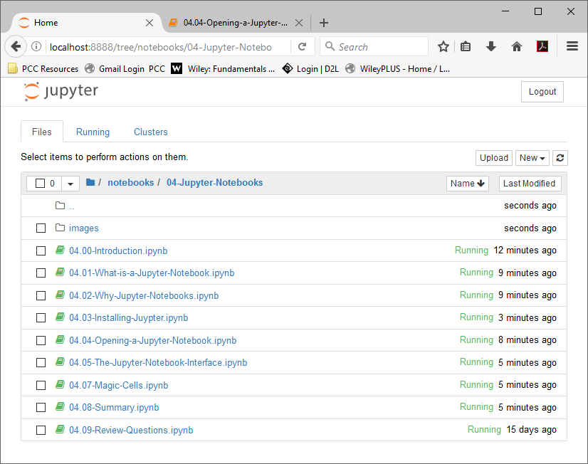

## Opening a Jupyter Notebook
One simple way to open a jupyter notebook on Windows is to click the Windows Start Button in the lower left-hand corner, select the Anaconda Folder, and click Jupyter Notebook.
### Open a Jupyter Notebook from the Anaconda prompt
To Open a Jupyter notebook from the Anaconda prompt, first open the Anaconda prompt, then type:

```text
> jupyter notebook
```

This will produce output in the Anaconda Prompt Window which looks something like:


A webbrowser will open and something which looks kind of like a file browser will be shown:



Here you can select an exhisting jupyter notebook file which will end with the ```.ipynb``` extension (which stands for IPython Notebook). You can also start a new Jupyter Notebook my clicking the [New] button in the upper right and selecting [Python 3]
 

