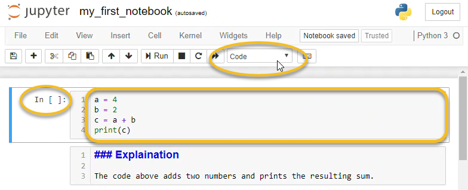
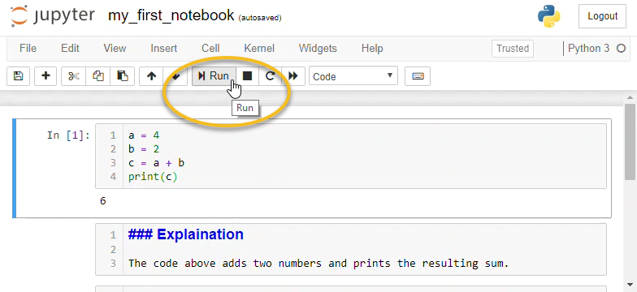
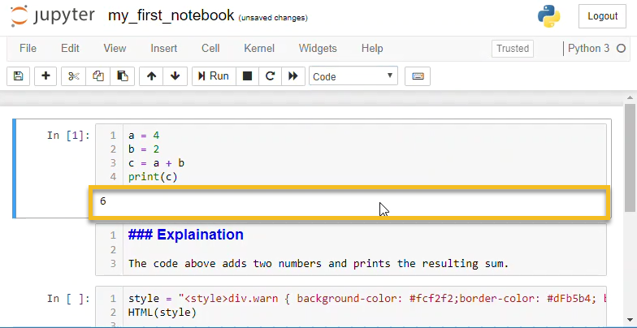
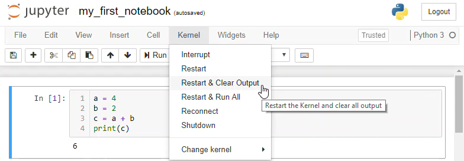
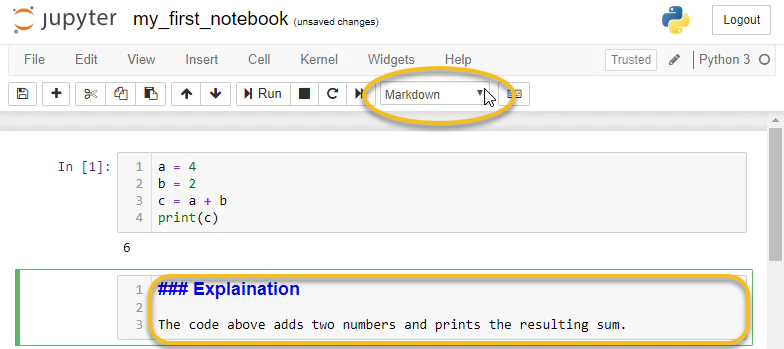

## The Jupyter Notebook Interface
When a new Jupyter notebook opens, you will see the Jupyter notebook interface. Across the top of the notebook you see the Jupyter icon and the Notebook name. You can click on the notebook name field and change the name of the notebook. Note that the file extension ```.ipynb``` is not printed in the file name field, but if you look in the Home tab, you will see that the notebook is saved with the ```.ipynb``` extension.
### Menus and Buttons

A Jupyter notebook is comprised of a bunch of _cells_ which are arrayed one after another in boxes below the menu items and buttons. There are three main types of cells: code cells, output cells, and markdown cells.
### Code Cells

In code cells, you can write Python code, then execute the Python code and see the resulting output. An example of a code cell is shown below. 



You can tell you are typing in a code cell because ```In [ ]:``` is shown to the left of the cell and the cell-type drop-down menu shows **Code**.

To run the Python code in a code cell push the [Run] button or type [Shift]+[Enter]. Hitting [Enter] when the cursor is inside a code cell brings the cursor down to a new line.


### Output Cells

After a code cell is run, an output cell can be produced below the code cell. The output cell contains the output from the code cell above it. Not all code produces output, so not all code cells produce output cells. The results in output cells can't be edited. If a code cell produces plots, charts or images, these outputs are shown in output cells. 



You can clear all the output cells and re-run code cells by selecting **[Kernal]** --> **[Restart Kernal and Clear Output]**.


###  Markdown Cells

Markdown cells don't contain Python code. Markdown cells contain text written in Markdown format.  Text in markdown cells can be formatted to show **bold** or _italic_ text. Tables, images, and lists can also be included in markdown cells.



Markdown cells are used for documentation and explaining your code. The text in a markdown cell is not executed. Markdown cells can be formatted with a few special characters.

Markdown cells are run like code cells. The difference is that when markdown cells are run, the text is formatted (when code cells run, code is executed). Markdown cells are run by clicking the [Run] button or by pressing ```[Shift]``` + ```[Enter]```

Text in markdown cells can be formatted using _markdown syntax_. An example of markdown syntax is putting an underscore before and after a word to cause the word to be formatted in _italics_.

#### Headings

Headings are created in markdown cells using the hash symbol ```#```. One ```#``` is the largest heading. Four hashes ```####``` is the smallest heading.

```
# H1 Heading
```

```
## H2 Heading
```

```
### H3 Heading
```

```
#### H4 Heading
```

#### Code Blocks
 
Code blocks can be inserted in Jupyter notebook markdown cells. For inline code blocks use the \` left quote character, the character to the left of the number ``[1]``` and above ```[Tab]`` on most keyboards.
 
 
This is inline code:  \` \` \` Inline code block \` \` \` within a paragraph
 
For a separated code block use three \` left quote characters on one line, followed by the code block on separate lines. Terminate the separate code block with a line of three \` left quote characters.
 
\`\`\`

Separated code block

\`\`\`

#### Bold and italics

**Bold** and _italic font_ is displayed by surrounding text with a double asterisk for ```**bold**``` and a single underscore for ```_italics_```


```**bold**``` produces **bold**

```_italics_``` produces _italics_

```**_bold and italic_**``` produces **_bold and italic_**

#### Tables

Tables are displayed using the pipe ```|``` character, which is [Shift]+[\\] on most keyboards. Columns are separated by pipes ```|``` and rows are separated by lines. After the header row, a row of pipes and dashes ```---``` are needed to define the table.

```text
| header1 | header 2 | header 3 |
| --- | --- | --- |
| col 1 | col 2 | col 3 |
| col 1 | col 2 | col 3 |
```

produces:

| header1 | header 2 | header 3 |
| --- | --- | --- |
| col 1 | col 2 | col 3 |
| col 1 | col 2 | col 3 |

#### Bullet Points and Lists

Bullet points are produced using the asterisk character ```*```

```
 * item 1
 * item 2
 * item 3
```

produces

 * item 1
 * item 2
 
Numbered lists are produced using sequential numbers followed by a dot. Indent sub-items with two spaces.

```
1. First item
2. Second item
3. Third item
  1. sub item
  2. sub item
    1. sub-sub item
    2. sub-sub item
```

produces

1. First item
2. Second item
3. Third item
  1. sub item
  2. sub item
    1. sub-sub item
    2. sub-sub item

#### Horizontal Rule

A horizontal rule is specified with three asterisks ```***``` on a single line.

```
***
```

produces

***

#### Links

Hyperlinks are specified using a set of square brackets ```[ ]``` followed by a pair of parenthesis ```( )``` The text inside the square brackets will be the link, the link address goes in the parenthesis.

```text
[Problem Solving with Python Book Link](https://problemsolvingwithpython.com/)
```

produces

[Problem Solving with Python Book Link](https://problemsolvingwithpython.com/)

#### Images

Images are embedded in Jupyter Notebook markdown using the exclamation point and square brackets ```![ ]```, followed by the image file path in parenthesis ```( )```. If the image can not be displayed, the text in square brackets will be shown. The image can be in the same directory as the notebook, or a relative path can be specified. In this case, the image ```engineering.png``` is stored in the ```images``` directory, which is a subdirectory of the directory the notebook is saved in.

```text

```

produces


#### LaTeX Math

LaTeX Math equations and symbols are rendered by markdown cells. A more extensive list of LaTeX commands can be found in the appendix.

```
$$ \int_{a}^{b} \frac{1}{x^2} dx $$
```

produces

$$ \int_{a}^{b} \frac{1}{x^2} dx $$

#### html

Because Jupyter notebooks are rendered by web browsers, just about any HTML tag can be included in the markdown portion of a notebook. An example of an HTML tag is the ```<sup>``` ```</sup>``` tags that surround superscript text.

```text
x<sup>2</sup>
```

produces

x<sup>2</sup>

Text can be colored using html ```<font>``` ```</font>``` tags

```text
<font color=red>Red Text</font>
```

produces

<font color=red>Red Text</font>

#### warning boxes

bootstrap style warning boxes can be included in Jupyter notebook markdown using ```<div>``` tags

```text
<div class="alert alert-danger" role="alert">
  <strong>Warning!</strong> Python lists start at 0
</div>
```

produces

<div class="alert alert-danger" role="alert">
  <strong>Warning!</strong> Python lists start at 0
</div>
### Creating a new cell

You can create a new cell in a Jupyter Notebook by clicking the [+] button in the upper menu. Clicking the [+] button produces a new code cell below the currently active cell.


You can also create a new cell using **Insert** --> **Insert Cell Above** or **Insert Cell Below**. You can choose to insert a cell above or below the currently active cell.
### Changing the cell type

The type of cell: code cell or markdown cell, is changed by clicking on a cell and selecting the cell type from the drop-down menu. Typing ```[Esc]``` + ```[m]``` changes the cell type to a markdown cell. Typing ```[Esc]``` + ```[y]``` changes the cell type to a code cell.


### Saving a Jupyter Notebook

Jupyter notebooks can be saved using the save icon in the upper menu or by pressing [Ctrl] + [s].


Jupyter notebooks can also be saved as a copy, similar to the Save As command common in many programs. To save a copy of a Jupyter notebook use **File** --> **Make a Copy...**


### Renaming a Jupyter Notebook

Jupyter notebooks are renamed by clicking on the notebook name above the upper menu and typing a new name into the dialog box.


### Downloading a Jupyter Notebook

Jupyter notebooks can be downloaded and saved using **File --> Download As --> Notebook (.ipynb)**. Selecting this menu option will download the notebook as a ```.ipynb``` file. 


Note that when a ```.ipynb``` file is viewed in a text editor like notepad, the notebook is unformatted and looks like a confusing jumble of text. The notebook needs to be opened in a Jupyter notebook file browser in order for the code in the notebook to run and the markdown text to render.


### Saving Jupyter Notebooks in Other Formats

Jupyter notebooks can be saved in other formats besides the native ```.ipynb``` format. These formats can be accessed using the **[File] --> [Download As]** menu.


The available file download types are:

 * Notebook (.ipynb) - The native jupyter notebook format
 * Python (.py) - The native Python code file type.
 * HTML (.html) - A web page
 * Markdown (.md) - Markdown format
 * reST (.rst) - Restructured text format
 * LaTeX (.tex) - LaTeX Article format
 * PDF via LaTeX - a pdf exported from LeTeX, requires a converter
 
When a Notebook is saved as a ```.py``` file, all text in markdown cells is converted to comments, and any code cells stay intact as Python code. 


<div class="cell border-box-sizing code_cell rendered">
<div class="input">
<div class="prompt input_prompt">In&nbsp;[&nbsp;]:</div>
<div class="inner_cell">
    <div class="input_area">
<div class=" highlight hl-ipython3"><pre><span></span> 
</pre></div>

    </div>
</div>
</div>

</div>
 

