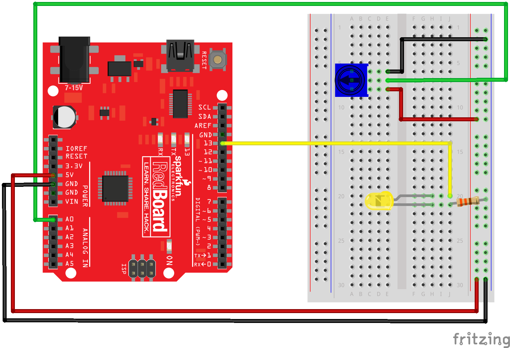
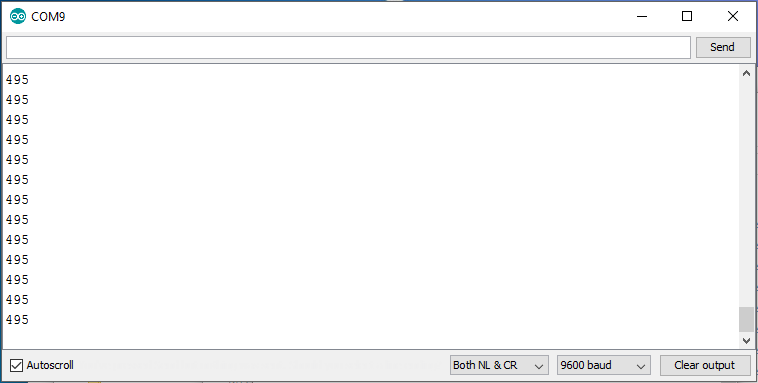
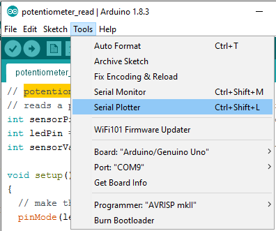
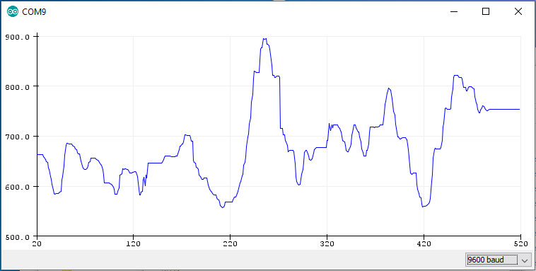

## Reading a Sensor with Python
In this section you will learn how to read a sensor connected to an external piece of hardware (an Arduino) using Python. To accomplish this, the following hardware is required:

 * A computer running Python
 * An Arduino
 * A potentiometer (the sensor)
 * wires, a resistor, an LED, and a breadboard to connect the sensor to the Arduino
 * A USB cable to connect the Arduino to the computer
### Wire the sensor to the Arduino
Connect the potentiometer sensor to the Arduino using a resistor, wires and a breadboard. The middle pin of the potentiometer is connected to pin A0 on the Arduino. Connect the LED to the Arduino. Note the long lead of the LED is connected to PIN13 on the Arduino and the short lead of the LED is connected through a resistor to ground. If the LED is wired backwards, the LED will not turn on.

In the hardware schematic, the blue square with an arrow on it is a potentiometer. Potentiometers are controlled by a user and the user knows when the sensor signal changes because the user has turned the potentiometer dial.

The hardware schematic describes how to the Arudino, LED, resistor, and potentiometer are connected with jumper wires and a breadboard.

### Upload code to the Arduino
Once the LED and potentiometer is hooked up the the Arduino, upload the following code to the Arduino using the Arduino IDE. Note that Arduinos don't use the Python programming language. The programming language used by Arduinos is a varient of the C programming language.

The Arduino sketch below (an Arduino program is called a sketch) accomplishes a couple things. First, the Arduino reads the potentiometer sensor value and stores the sensor value in the variable ```sensorValue```. Next, the Arduino sends the sensor value over the serial line (as a byte sting). Finally, ```sensorValue``` is compared to ```500```. If ```sensorValue``` is less than ```500```, the LED stays off. If ```sensorValue``` is greater than ```500```, the LED turn on. This read-send-compare process repeats in a loop.
```text
// potentiometer_read.ino
// reads a potentiometer and sends value over serial
int sensorPin = A0;    // The potentiometer is connected to analog pin 0                  
int ledPin = 13;      // The LED is connected to digital pin 13
int sensorValue;     // an integer variable to store the potentiometer reading

void setup() // this function runs once when the sketch starts
{
  // make the LED pin (pin 13) an output pin
  pinMode(ledPin, OUTPUT);

  // initialize serial communication
  Serial.begin(9600);
}

void loop() // this function runs repeatedly after setup() finishes
{
  sensorValue = analogRead(sensorPin);  // read the voltage at pin A0   
  Serial.println(sensorValue);         // Output sensor value to Serial Monitor
  
  if (sensorValue < 500) {            // if sensor reading is less than 500,
    digitalWrite(ledPin, LOW); }     // Turn the LED off
  
  else {                               // if sensor reading is greater than 500
    digitalWrite(ledPin, HIGH); }     // Keep the LED on
  
  delay(100);             // Pause 100 milliseconds before next sensor reading
}
```
### Connect the Arduino to the computer and Upload the Sketch
Connect the Arduino to the computer with a USB cable. Upload the sketch to the Arduino. In the Arduino IDE, click the [check mark] to verify and the [arrow] to upload. If the sketch does not upload, check which ```COM port``` is selected in Tools --> Ports.


### Check the Sensor Signal
To verify the Arduino sketch is working correctly, the sensor signal can be checked in three ways:

 * The LED turns on and off as the potentiometer dial is rotated
 * In the Arudino **Serial Monitor**, numbers change as the potentiometer dial is rotated
 * In the Arduino **Seral Plotter**, the line moves as the potentiometer dial is rotated
#### LED turns ON and OFF

The LED should turn on and off as the potentiometer is rotated. If the LED does not turn on and off when the poteniometer is rotated, make sure the potentiometer is turned back and forth through it's full range of rotation. Also ensure the USB cable is plugged in to both the Arudino and the computer.
#### Arudino Serial Monitor

Access the Arduino **Serial Monitor** using Tools --> Serial Monitor. 


If the Arduino sketch is working correctly, a running list of numbers is shown in the Arduino **Serial Monitor**. When the potentiometer is dialed back and forth, the numbers streaming down the **Serial Monitor** should change. The output in the Serial Monitor should be a running list of numbers between ```0``` and ```1024```.

If a running list of numbers can't be seen in the Arduino **Serial Monitor**, ensure [Auto Scroll], [Both NL & CR] and [9600 baud] are selected. Also make sure the ```Port``` is set correctly in Tools --> Port. 


#### Arduino Serial Plotter

To access the Arduino Serial Plotter, select Tools --> Serial Monitor. Note the Arduino Serial Monitor needs to be closed before the Serial Plotter can be opened. If the sketch is working correctly, potentiometer rotation produces a moving line on the Arduino Serial Plotter . 



The output of the Serial Plotter should be a running line graph. The height of the line on the graph should change as the potentiometer is dialed back and forth. If the Serial Plotter is blank, make sure [9600 baud] is selected in the lower right corner of the Serial Plotter. Also make sure the ```Port``` has been set correctly in Tools --> Port.



### Write a Pyton script to read the sensor
After the hardware is connected and the Arduino sketch is working properly, we can construct a Python script to read the sensor value.

Communication between the Python script and the Arduino an be accomplished using the PySerial package. Make sure PySerial is installed before the script is run.

At the top of the Python script, import the PySerial module. Note that although the package is called PySerial, use the line ```import serial``` to import the package.
```python
import serial
import time
```
Next, we'll code a loop runs for about 5 seconds while data is collected from the sensor. If it seems like the loop is stuck, press [Ctrl] + [c].
```python
data = [] # create an empty list to store the data
for i in range(50):
    with serial.Serial('COM4', 9800, timeout=1) as ser:
        line = ser.readline()   # read a '\n' terminated line
        string = line.decode()  # convert the byte string to a unicode string
        data.append(float(string)) # convert the unicode string to a float and add to the data list
        time.sleep(0.1) # wait 0.1 seconds before reading the next line
```      
After the data is collected, the data can be displayed with the ```print()``` function and a ```for``` loop. The output looks like the numbers in the Arduino **Serial Monitor**.
```python
for line in data:
    print(line)
```
The data can also be plotted with Matplotlib. The resulting plot looks like the line plot in the Arduino **Serial Plotter**.
```python
import matplotlib.pyplot as plt
# if using a jupyter notebook include, comment out if using a .py file
%matplotlib inline

plt.plot(data)
plt.show()
```
 

