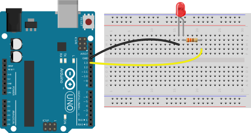

## Controlling an LED with Python
In this section we are going to control an LED connected to an external piece of hardware (in this case an Arduino) using Python. To accomplish this the following hardware is required:

 * A computer running Python
 * An Arduino
 * An LED
 * Wires, a resistor and a breadboard to connect the LED to the Arduino
 * A USB cable to connect the Arduino to the computer
### Set up the LED
Connect the LED to the Arduino using a resistor, wires and a breadboard. Note the short leg of the resistor should be connected to ground and the long leg of the resistor should be connected to a resistor and then PIN 13. A resistor is needed to prevent too much current from flowing through the LED. This type of resistor is called a _pull up resistor_.

### Upload code to the Arduino
Upload the following code to the Arduino using the Arduino IDE. This is the example sketch called ```Physical Pixel```. The sketch can be found in the Arduino IDE by going to File --> Examples --> 04.Communication --> PhysicalPixel


The code for the Physical Pixel Sketch is also shown below. Note that Arduinos use a programming language that is not Python.
```text
//  Found in the Arduino IDE: File --> Examples --> 04.Communication --> PhysicalPixel

const int ledPin = 13; // the pin that the LED is attached to
int incomingByte;      // a variable to read incoming serial data into

void setup() {
  // initialize serial communication:
  Serial.begin(9600);
  // initialize the LED pin as an output:
  pinMode(ledPin, OUTPUT);
}

void loop() {
  // see if there's incoming serial data:
  if (Serial.available() > 0) {
    // read the oldest byte in the serial buffer:
    incomingByte = Serial.read();
    // if it's a capital H (ASCII 72), turn on the LED:
    if (incomingByte == 'H') {
      digitalWrite(ledPin, HIGH);
    }
    // if it's an L (ASCII 76) turn off the LED:
    if (incomingByte == 'L') {
      digitalWrite(ledPin, LOW);
    }
  }
}
```
### Connect the Arduino to the Computer
Connect the Arduino to the computer using a USB cable. Make sure a port is selected in the Arduino IDE: Tools --> Port --> COM4 (for example). 

In the Arduino IDE, click the checkmark to verify and the arrow to upload. If the sketch does not upload, check which COM port is selected in Tools --> Ports.


### Turn the LED on and off with the Arduino Serial Monitor
Bring up the Arduino Serial Monitor and type ```L``` and ```H``` and see the LED turn on and off.
### Write a Pyton Script to turn the LED on and off
After the LED is connected and the LED turns on and off based on input at the Arduino Serial Monitor, it is time to write a Python script to turn the LED on and off. This can be accomplished using the **PySerial** package. Make sure **PySerial** is installed before script is run. 

At the top of the script, import the **PySerial**. Note that even though the package is called **PySerial** the line ```import serial``` is used.
```python
import serial
import time
```
In the next part of the Python scripts, create a loop that will run for about 5 seconds while the LED is blinked on and off. Note the byte string ```H``` need to be sent to the Arduino, not the unicode string ```H```. The unicode string is pre-pended with the letter ```b``` as in ser.writelines(b'H').
```python
data = [] #create an empty list to store the data
for i in range(10):
    with serial.Serial('COM4', 9800, timeout=1) as ser:
        ser.writelines(b'H')   # send a byte
        time.sleep(0.5) # wait 0.5 seconds bfore reading the next line
        ser.writelines(b'L')   # send a byte
```     
### Write a Python script to allow a user to turn the LED on and off
Once the LED blinks on and off, it is time to write a Python script to allow a user to turn the LED on and off. At the top of the Python script import the PySerial Module.
```python
import serial
import time
```
Next give the user instructions. If the user types ```H```, the LED will turn on. If the user types ```L``` the LED will turn off. If the user types ```q```, the program will quit.
```python
print('This is a program that allows a user to turn an LED on and off')
print('H to turn the LED on')
print('L to turn the LED off')
print('q to quit')
```
Finally, the script needs a loop to ask the user for an ```H``` or ```L``` character. Once the user enters the letter, the  letter needs to be converted to a byte string,. The byte string can then sent over the serial line to the Arduino. A delay is added so that the Arduino can process the previous command before dealing with the next one. 
```python
user_input = input('H = on, L = off, q = quit' : )
while user_input != 'q':
    with serial.Serial('COM4', 9800, timeout=1) as ser:
        byte_command = encode(user_input)
        ser.writelines(byte_command)   # send a byte
        time.sleep(0.1) # wait 0.5 seconds before reading the next line

print('q entered. Exiting the program')
```    
        
 

