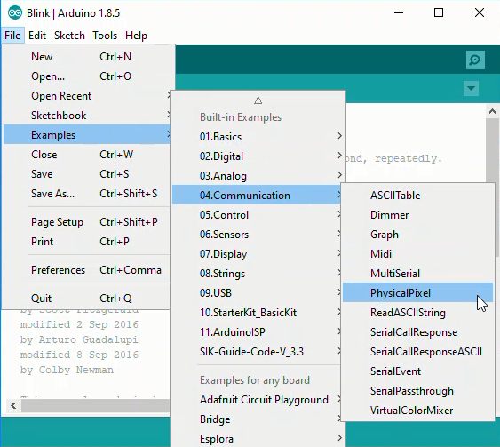

## Controlling an LED with Python
In this section you will learn how to control an LED connected to an external piece of hardware (an Arduino) using Python. To accomplish this task, the following hardware is required:

 * A computer running Python
 * An Arduino
 * An LED
 * Wires, a resistor and a breadboard to connect the LED to the Arduino
 * A USB cable to connect the Arduino to the computer
### Wire the LED to the Arduino
Connect the LED to the Arduino using a resistor, wires and a breadboard. Note the short leg of the LED is connected to ground, and the long leg of the resistor is connected through a resistor to PIN 13. A resistor is needed to prevent too much current from flowing through the LED. This type of resistor is called a _pull up resistor_.

### Upload code to the Arduino
Upload the following code to the Arduino using the Arduino IDE. This is the example sketch called ```Physical Pixel```. The ```Physical Pixel``` sketch is found in the Arduino IDE under File --> Examples --> 04.Communication --> PhysicalPixel



The code for the Physical Pixel Sketch is shown below.
```text
//  Arduino IDE: File --> Examples --> 04.Communication --> PhysicalPixel

const int ledPin = 13; // the pin that the LED is attached to
int incomingByte;      // a variable to read incoming serial data into

void setup() {
  // initialize serial communication:
  Serial.begin(9600);
  // initialize the LED pin as an output:
  pinMode(ledPin, OUTPUT);
}

void loop() {
  // see if there's incoming serial data:
  if (Serial.available() > 0) {
    // read the oldest byte in the serial buffer:
    incomingByte = Serial.read();
    // if it's a capital H (ASCII 72), turn on the LED:
    if (incomingByte == 'H') {
      digitalWrite(ledPin, HIGH);
    }
    // if it's an L (ASCII 76) turn off the LED:
    if (incomingByte == 'L') {
      digitalWrite(ledPin, LOW);
    }
  }
}
```
### Connect the Arduino to the Computer
Connect the Arduino to the computer using a USB cable. Make sure the ```Port``` is selected properly in the Arduino IDE under Tools --> Port. 

In the Arduino IDE, click the [checkmark] to verify and the [arrow] to upload. If the sketch does not upload, check which COM port is selected in Tools --> Port.


### Turn the LED on and off with the Arduino Serial Monitor
Open the Arduino Serial Monitor using Tools --> Serial Monitor. In the Serial Monitor type ```L``` or ```H``` and click [Send]. Observe the LED turn on and off. Send ```H``` to turn the LED on. Send ```L``` to turn the LED off.


### Write a Pyton Script to turn the LED on and off
After the LED turns on and off based on sending ```H``` and ```L``` with the Arduino Serial Monitor, we can write a Python script to turn the LED on and off. Again, the serial communication between the Python script and the Arduino is facilitated by the PySerial package. Ensure PySerial is installed before running the Python script. 

At the top of the Python script, import the PySerial package. Note that even though the package is called PySerial, the line ```import serial``` is used. Python's built-in ```time``` module is also imported as the ```time.sleep()``` function will be used in the script.
```python
import serial
import time
```
In the next part of the Python script, create a loop that blinks the LED on and off for about 5 seconds. Note the byte string ```b'H'``` is sent to the Arduino, not the unicode string ```'H'```. The unicode string ```'H'``` is pre-pended with the letter ```b``` in the line ```ser.writelines(b'H')```.
```python
data = []
for i in range(10):
    with serial.Serial('COM4', 9800, timeout=1) as ser:
        ser.writelines(b'H')   # send a byte
        time.sleep(0.5)        # wait 0.5 seconds before reading the next line
        ser.writelines(b'L')   # send a byte
```     
### Write a Python script to allow a user to turn the LED on and off
Once the LED blinks on and off successfully using a for loop in a Python script, we can write a new Python script that allows a user to turn the LED on and off. At the top of the new Python script import the PySerial package and built-in time module.
```python
import serial
import time
```
Next, give the user instructions. If the user types ```H```, the LED turns on. If the user types ```L``` the LED turns off. If the user types ```q```, the program terminates.
```python
print('This is a program that allows a user to turn an LED on and off')
print('type H to turn the LED on')
print('type L to turn the LED off')
print('type q to quit')
```
Finally, the script needs a while loop to ask the user to  enter the letter ```H```, ```L``` or ```q```. Once the user enters the letter, the letter is converted to a byte string. Next, the byte string is sent over the serial line to the Arduino. A delay is added so that the Arduino can process the command before reading with the next one. 
```python
user_input = input('H = on, L = off, q = quit' : )
while user_input != 'q':
    with serial.Serial('COM4', 9800, timeout=1) as ser:
        byte_command = encode(user_input)
        ser.writelines(byte_command)   # send a byte
        time.sleep(0.1) # wait 0.5 seconds before reading the next line
        user_input = input('H = on, L = off, q = quit' : )
print('q entered. Exiting the program')
```    
        
Run the Python script. Type ```H``` and ```L``` and observe the LED turn on and off. Type ```q``` to end the program.
 

