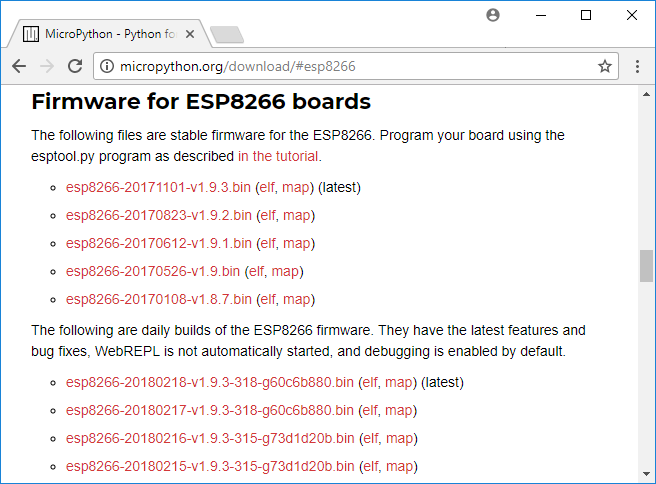
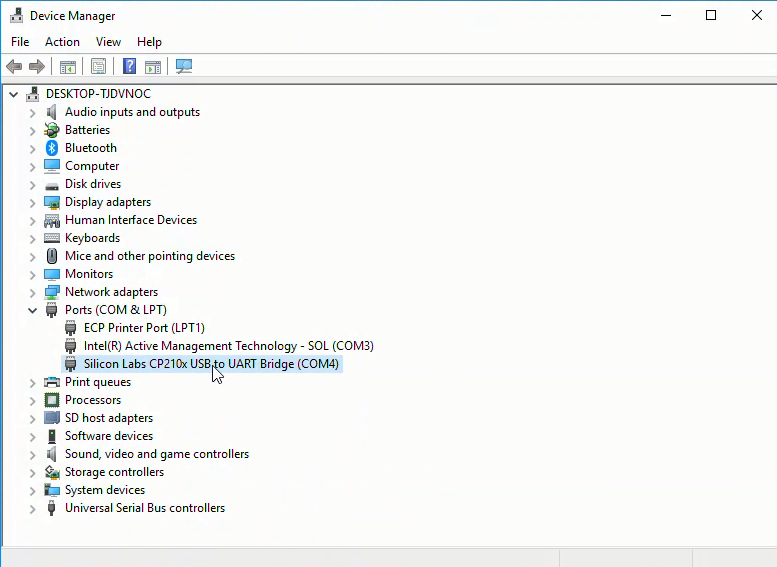
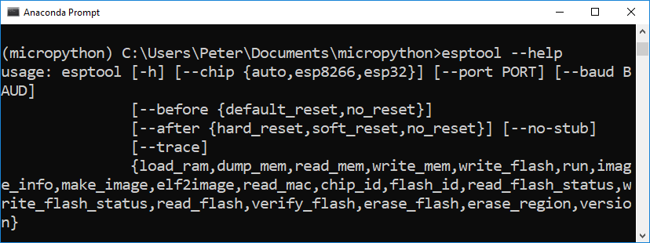

## Installing MicroPython
MicroPython is a port of the Python programming language that runs on small, inexpensive microcontrollers. In this section, you will learn how to install MicroPython on an Adafruit Feather Huzzah ESP8266 microcontroller using Python and a package called **esptool**. In subsequent sections, you will learn how to blink an LED and read a sensor using MicroPython.
To install MicroPython on an ESP8266-based microcontroller, like the Adafruit Feather Huzzah ESP8266, we need the following hardware:

| Hardware | Purpose |
| --- | --- |
| A laptop or desktop computer | install Micropython on the microcontroller |
| Adafruit Feather Huzzah ESP8266 | microcontroller running MicroPython |
| microUSB cable | connect the microcontroller to computer |

To install MicroPython we will use the following software and tools:

| Software | Purpose |
| --- | --- |
| Anaconda distribution of Python | run **esptool** that installs MicroPython |
| Anaconda Prompt | Install the **esptool** package using **pip** |
| **esptool** | A **pip** installable package used to install MicroPython |
| firmware **_.bin_** file | Version of MicroPython run on the microcontroller |


### Summary of Steps:
1. Install the [Anaconda distribution](https://www.anaconda.com/download/) of Python
2. Create a new conda environment and ```pip install esptool```
3. Download the [latest MicroPython .bin firmware file](http://micropython.org/download#esp8266)
4. Install the [SiLabs driver](https://www.silabs.com/products/development-tools/software/usb-to-uart-bridge-vcp-drivers) for the Adafruit Feather Huzzah ESP8266
5. Connect the Adafruit Feather Huzzah ESP8266 board to the laptop using a microUSB cable
6. Determine which serial port the Feather Huzzah is connected to
7. Run the esptool to upload the .bin firmware file to the Feather Huzzah
8. Download and install [Putty](https://www.putty.org/), a serial monitor
9. Use Putty to connect to the Feather Huzzah and run commands in the MicroPython REPL
### Install the Anaconda distribution of Python
If you don't have Anaconda installed already, go to [Anaconda.com/download](https://www.anaconda.com/download/) and install the latest version.
### Create a new conda environment and install **esptool**
To install MicroPython on the ESP8266-based microcontoller, we will start out by creating a _virtual environment_. A virtual environment is an isolated Python interpreter and set of packages that are separate from the base version of Python running on your computer. We'll create a new virtual environment with the Anaconda Promt and the conda command line tool to use with our MicroPython projects. 

Open the Anaconda prompt and create a new virtual environment named ```micropython```. Activate the environment with the ```conda activate``` command. After activating the virtual environment you should see ```(micropython)``` before the Anaconda Prompt.  Once inside the virtual environment, use ```pip``` to install ```esptool```. The ```esptool``` will be used to upload the MicroPython .bin firmware file onto the Adafruit Feather Huzzah board. Confirm that ```esptool``` is installed in the ```(micropython)``` virtual environment with ```conda list```. The list of commands below also creates a new directory in the **Documents** folder called **micropython** to store all the project files. 

```text
> conda create -n micropython python=3.6
> conda activate micropython
(micropython) > pip install esptool
(micropython) > conda list
(micropython) > cd Documents
(micropython) > mkdir micropthon
(micropython) > cd micropython
```
### Download the latest MicroPython firmware .bin file
Go to GitHub.com and [download the latest .bin firmware](https://micropython.org/download#esp8266) file at micropython.org/download#esp8266. Move the **_.bin_** firmware file to a new **micropython** directory. The **_.bin_** firmware file is the version of MicroPython that runs on the Adafruit Feather Huzzah ESP8266. Straight from Adafruit, the Feather Huzzah microcontroller does not have MicroPyton installed, so we need to install MicroPython ourselves. After installing the Micropython .bin firmware file onto the board, we will be able to bring up the MicroPython REPL prompt, type commands into the Micropython REPL and run Micropython **_.py_** scripts on the board.


### Install the SiLabs driver for the Adafruit Feather Huzzah ESP8266
Before we can connect the Adafruit Feather Huzzah to the computer, we need a specific driver installed. For my Windows 10 laptop to see the Adafruit Feather Huzzah board, the [CP210x USB to UART Bridge VCP driver](https://www.silabs.com/products/development-tools/software/usb-to-uart-bridge-vcp-drivers) needs to be downloaded from SiLabs and installed. This is quick and easy, but does require admin privileges.


### Connect the Adafruit Feather Huzzah ESP8266 board to the laptop
Use a microUSB cable (the same kind of cable that charges many mobile phones) to connect the Feather Huzzah to the computer. Make sure that the microUSB cable is a full USB __data cable__ and not just a simple power cable. If you have trouble getting the Feather Huzzah to work, one reason might be the micoUSB cable is only a charging cable and can not transfer data. 
### Determine which serial port the Feather Huzzah is connected to
Use the Windows Device Manager to determine which serial port the Feather Huzzah board is connected to. The serial port is one of the parameters that needs to be defined when the .bin firmware file is upload on the board. Look for something like **Silicon Labs CP210x USB to UART Bridge (COM4)** in the **Ports (COM & LPT)** menu. The USB to UART bridge is actually the Feather Huzzah board. CP210x refers to the chip that handles serial communication on the Feather Huzzah, not the ESP8266 chip itself. Make note of the number after **(COM )**. It often comes up as **(COM4)** but it may be different on your computer. 



### Run esptool to upload the .bin file to the Feather Huzzah
Open the Anaconda Prompt and ```cd```(change directory) into the **micropython** directory which contains the **_.bin_** file. Use the ```dir``` command to see the **micropython** directory contents. Make sure the **_.bin_** firmware file is in the directory. The **_.bin_** firmware file will be called something like ```esp8266-20171101-v1.9.3.bin```. Activate the micropython environment with the command ```conda activate micropython```. Run ```esptool --help``` to ensure **esptool** is installed properly. Note there is no **.py** extension after ```esptool```. On my Windows laptop, the command ```esptool``` worked, but the command ```esptool.py``` did not (this is different than the commands shown on the [MicroPython docs](https://docs.micropython.org/en/latest/esp8266/esp8266/tutorial/intro.html#deploying-the-firmware)). If you try to run esptool and you are not in the ```(micropython)``` virtual environment, you will get an error. 

```text
> cd Documents
> cd micropython
> pwd
Documents/micropython
> dir
> conda activate micropython
(micropython) > esptool --help
```



Before we write the **_.bin_** firmware file to the board, we should first erase the flash memory on the Feather Huzzah using the command ```esptool erase_flash```. Make sure to specify the ```--port```. The argument after ```--port``` is the ```COM``` port assigned to the ESP8266 board shown in the Windows Device Manager.  This port often comes up as ```COM4```.

```text
(micropython) > esptool --port COM4 erase_flash
```


Now it's time to write the .bin firmware file to the flash memory on the board using the ```esptool write_flash``` command. Make sure to use the exact .bin firmware file name you see sitting in the **micropython** directory. The port has to be set as the port you found in the Windows Device Manager. ```---baud``` is the baud rate, or upload speed. I found that ```--baud 460800``` worked, but you could also specify ```--baud 115200``` which is slower. The upload time was a matter of seconds with either baud rate. The ```0``` after ```--flash_size=dectect``` means we want the firmware to be written at the start of the flash memory (the 0th position) on the board. Again, make sure the .bin firmware file name is correct. It is easy to mistype. Another issue I ran into was that I tried to use the command ```esptool.py``` instead of ```esptool``` as shown on the [MicroPython docs](https://docs.micropython.org/en/latest/esp8266/esp8266/tutorial/intro.html#deploying-the-firmware). The documentation for [MicroPython on the ESP8266](https://docs.micropython.org/en/latest/esp8266/esp8266/tutorial/intro.html#deploying-the-firmware) specifies the command ```esptool.py``` (including the **_.py_** file extension). This did work on my Windows 10 machine. Omitting the **_.py_** file extension, and running ```esptool``` worked instead. 

```text
(micropython) > esptool --port COM4 --baud 460800 write_flash --flash_size=detect 0 esp8266-20171101-v1.9.3.bin
```


### Download and install PuTTY, a serial monitor
Now that MicroPython is installed on the board, we need to with our board over a serial connection. Windows 10 doesn't have a built-in serial monitor (like screen on MacOS and Linux). Therefore, if you are using the Windows operating system, you need to download and install a serial communication tool like **PuTTY**. PuTTY is a lightweight serial and SSH client for Windows. PuTTY provides an interface to communicate with the Adafruit Feather Huzzah board. [PuTTY can be downloaded here](https://www.putty.org/). PuTTY is pretty small and the download and installation should be pretty quick.


### Use PuTTY to connect to the Feather Huzzah
Ensure the Feather Huzzah board is connected to the computer with a USB cable and ensure you can see the board in the Windows Device Manager. Then use PuTTY to connect to the board over serial.  Make sure you specify the correct serial port in the **Serial line** box and **115200** baud in the Speed box. **Micropython is set to run at 115200 baud**, other baud rates will lead to junk characters in the serial monitor. Make sure you need to select the **Serial** radio button below the header **Connection type:** near the top of the PuTTY window. It is easy to overlook this detail. 


If you see ```>>>``` the MicroPython REPL (the MicroPython prompt) is running and the Adafruit Feather Huzzah ESP8266 is working! This version of Python isn't running on your computer, it's MicroPython running on the little microcontroller! Sometimes I had to type [Enter] or Ctrl-D to get the ```>>>``` REPL prompt to show up. A few times I needed to close Putty, unplug then replug the board and try Putty again. The Feather Huzzah also has a tiny little black RESET button that can be pressed to restart the board.  


At the ```>>>``` MicroPython REPL prompt try the following commands:

```text
>>> print('Problem Solving with MicroPython!')
Problem Solving with MicroPython!

>>> import sys
>>> sys.platform
'esp8266'
```


 

