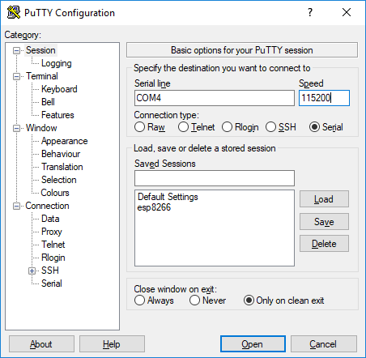

## Blinking a LED
In this section, you will learn how to blink the built-in LED on ESP8266 microcontroller using the MicroPython REPL.

Before the LED on the ESP8266 microcontroller can be blinked, MicroPython needs to be installed on the board and PuTTY needs to be installed (if using Windows 10) to facilitate communication between the microcontroller and the computer. Alternatively, a MacOS or Linux terminal and the **screen** utility can be used for serial communication.
The ESP8266 Microcontroller as a built-in red LED mounted on the board close to the USB cable input. We can use MicroPython to blink this LED on and off.
### Connect the ESP8266 Microcontroller to the computer with a USB cable and bring up the MicroPython REPL using PuTTY.
Connect the Adafruit Feather Huzzah ESP8266 to the computer with a microUSB cable. Ensure this is a USB data cable, not just a charging cable. Open Putty and connect to the Feather Huzzah using the proper serial port (COM#) and 115200 baud. (Remember to use the **Serial** radio button under **Connection Type:**)




This will bring up the MicroPython REPL prompt ```>>>```. If you can't see the ```>>>``` prompt, try typing [Enter] or Ctrl-D or push the RESET button on the Feather Huzzah. If none of these methods work, try closing Putty and unplugging then replugging in the USB cable.
### Run code at the MicroPython REPL to turn the LED on and off
In the PuTTY serial window, test to see if the MicroPython REPL is functioning with a basic _Hello World_ program.

```text
>>> print("Hello World")
Hello World
```

Next, we will blink the Feather Huzzah's built-in LED. The Feather Huzzah has a built-in LED connected to Pin 0. If we control the current going to Pin 0, we control the built-in LED. To control a Pin using MicroPython, first the **machine** module needs to be imported. Next a ```Pin``` object needs to be created. The integer passed into ```machine.Pin()``` determines the pin number assigned to the ```Pin``` object.

```text
>>> import machine
>>> pin = machine.Pin(0)
```

The value (on or off) of Pin 0 can be returned using

```text
>>> pin.value
1
```

To assign a value to Pin 0, the ```Pin``` object must be created as an _output_ pin. An output pin is a pin where a program or user determines the pin output. An input pin is a pin set up to read input, like the input from a sensor. In this case we want to assign Pin 0 as an output pin.

```text
>>> pin = machine.Pin(0, machine.Pin.OUT)

# turn the LED on
>>> pin.value(0)

# turn the LED off
>>> pin.value(1)
```


### Run code at the MicroPython REPL to blink the LED
Now we can write a for loop at the MicroPython REPL to blink the LED on and off. In order to do this, we need to import the **machine** module and the **time** module.
```text
>>> import machine
>>> import time
>>> pin = machine.Pin(0, machine.Pin.OUT)
>>> for i in range(10):
...     pin.value(1)
...     time.sleep(0.5)
...     pin.value(0)
...     time.sleep(0.5)
# [backspace] to exit loop indent and [Enter] to execute the loop.
.... 
```
 

